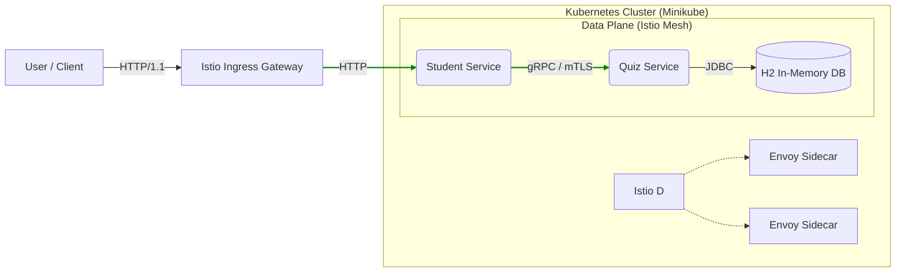

# Microservices Service Mesh Project

A robust microservices architecture demonstrating **Spring Boot**, **gRPC**, **Kubernetes**, and **Istio Service Mesh**. This project simulates a Quiz Platform where students can fetch quizzes and submit results, with secure and efficient inter-service communication managed by Istio.

## 🏗 System Architecture

The system consists of two core microservices communicating via **gRPC** (Google Remote Procedure Call) for high performance and strong typing.



### Components
1.  **Student Service** (`:8080`, `:9090`):
    *   **Role**: Acts as the edge service/BFF (Backend for Frontend).
    *   **Function**: Receives HTTP REST requests from users, converts them to gRPC calls, and forwards them to the Quiz Service.
    *   **Key Tech**: Spring Boot Web, gRPC Client, Envoy Sidecar.

2.  **Quiz Service** (`:9090`):
    *   **Role**: Core domain service.
    *   **Function**: Manages Quiz data and Questions. Handles gRPC requests.
    *   **Key Tech**: Spring Boot Data JPA, H2 Database, gRPC Server, Envoy Sidecar.

3.  **Common Proto**:
    *   **Role**: Shared module containing Protocol Buffer (`.proto`) definitions.
    *   **Examples**: `QuizRequest`, `QuizResponse`, `ResultRequest`.

4.  **Istio Service Mesh**:
    *   **Control Plane**: `istiod` manages configuration and certificate distribution.
    *   **Data Plane**: Envoy proxies (sidecars) injected into every pod intercept and secure all traffic (mTLS).
    *   **Ingress Gateway**: Manages external entry into the cluster.

---

## 🚀 Technologies Used
*   **Java 17** (Amazon Corretto)
*   **Spring Boot 3.2.1**
*   **gRPC** (via `net.devh:grpc-spring-boot-starter`)
*   **Protocol Buffers (Protobuf)**
*   **Docker**
*   **Kubernetes (Minikube)**
*   **Istio 1.28**

---

## 🛠 Prerequisites
*   [Docker Desktop](https://www.docker.com/products/docker-desktop/)
*   [Minikube](https://minikube.sigs.k8s.io/docs/start/)
*   [Kubectl](https://kubernetes.io/docs/tasks/tools/)
*   [Istio CLI (`istioctl`)](https://istio.io/latest/docs/setup/getting-started/#download)

---

## ⚙️ Setup & Deployment

### 1. Start Environment
Start Minikube and point your shell to its Docker daemon. This allows you to build images directly inside the cluster without pushing to a remote registry.
```bash
minikube start
eval $(minikube docker-env)
```

### 2. Install Istio
Install Istio if not already present.
```bash
istioctl install --set profile=demo -y
```

### 3. Build & Dockerize
Build the Java applications and create the Docker images.
```bash
./mvnw clean install -DskipTests

docker build -t quiz-service:1.0.0 quiz-service/
docker build -t student-service:1.0.0 student-service/
```

### 4. Deploy to Kubernetes
Apply the database namespace, deployments, and Istio configuration.
```bash
kubectl apply -f k8s/
```
*   `namespace.yaml`: Creates `quiz-platform` namespace with `istio-injection=enabled`.
*   `quiz-deployment.yaml`: Deploys Quiz Service.
*   `student-deployment.yaml`: Deploys Student Service.
*   `istio-gateway.yaml`: Configures the Ingress Gateway and VirtualService.

---

## ✅ Verification

### Check Pods
Ensure all pods show **2/2** containers (1 for App, 1 for Istio Sidecar).
```bash
kubectl get pods -n quiz-platform
```

### Test Workflow (via Port Forward)
Since we are on Minikube, port-forwarding is the easiest way to test.

1.  **Expose Student Service**:
    ```bash
    kubectl port-forward svc/student-service 8080:8080 -n quiz-platform
    ```

2.  **Take a Quiz** (HTTP GET -> gRPC GetQuiz):
    ```bash
    curl http://localhost:8080/student/quiz/1
    ```
    *Response:* Details of the "General Knowledge" quiz.

3.  **Submit Result** (HTTP POST -> gRPC SubmitResult):
    ```bash
    curl -X POST "http://localhost:8080/student/quiz/1/submit?studentId=student123&score=95"
    ```
    *Response:* "Result processed successfully"

---

## 🔒 Security & Robustness (Why Service Mesh?)

1.  **Mutual TLS (mTLS)**: All traffic between `student-service` and `quiz-service` is automatically encrypted by the Envoy sidecars. You don't need to implement TLS in Java code.
    *   *Verify:* `istioctl x describe pod -n quiz-platform <student-pod>` shows strict/permissive mTLS.
2.  **Traffic Management**: Istio allows for advanced routing (Canary deployments, A/B testing) via `VirtualServices`.
3.  **Observability**: Istio automatically collects metrics and traces for all calls (viewable in Kiali/Jaeger if installed).

## 📂 Project Structure
```text
Microservices_PE/
├── common-proto/       # Shared Protobuf Definitions
├── quiz-service/       # gRPC Server (Domain Logic)
├── student-service/    # gRPC Client (Edge Service/Controller)
├── k8s/                # Kubernetes Manifests
├── pom.xml             # Parent Maven POM
└── README.md           # Documentation
```
